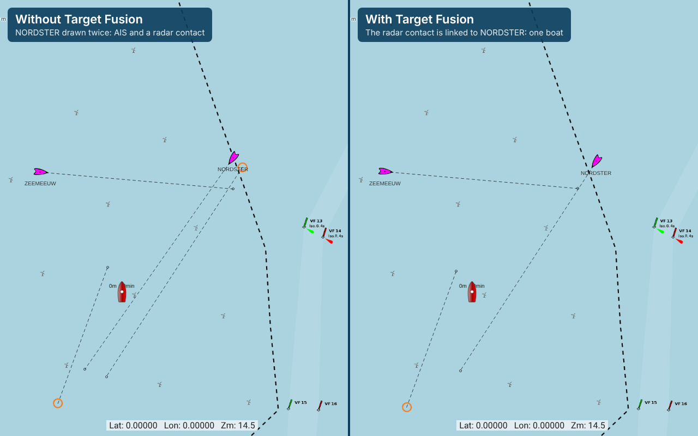

# Signal K Target Fusion

AIS, radar and cameras often see the same boat. This plugin works out which radar and camera targets are a boat AIS already reports, or are the same boat seen by two sensors, and says so in the data model. Collision alarms and chart plotters that follow these links show and alarm each boat once.



## Setup

Install **Target Fusion** from the App Store and enable it. There is nothing else to set up: it starts linking as soon as a sensor plugin publishes targets. You need:

- a sensor plugin that publishes its targets as `targets.<type>:<id>`, such as the MaYaRa radar plugin (1.7.0 or later) for ARPA targets, and
- AIS, from any connection that brings AIS vessels into Signal K.

The links are only useful to software that follows them. The Collision Alerts plugin raises one alarm per boat instead of one per sensor, and a chart plotter that shows sensor targets (Freeboard-SK, from the release that adds them) draws a linked target as part of its AIS vessel.

## How it works

Radar and camera plugins publish what they track as `targets.<type>:<id>` contexts (see the server's _Sensor targets_ plugin documentation). Every two seconds (configurable) this plugin compares them with the AIS vessels and sets `sameAs` on each target that is the same object as another context:

```
targets.radar:nav1034A-17  sameAs  "vessels.urn:mrn:imo:mmsi:244060000"
```

A target is linked to an AIS vessel when:

- the sensor identified the vessel by its MMSI, or
- the AIS position, moved forward to the time of the radar or camera observation, is within 200 m of the target (configurable; beyond 4 km from own ship the distance is 5% of the range instead, because radar bearings are less precise there), and the two agree on course (within 45°, compared once both make 1 m/s) and speed (within half the faster of the two, and never tighter than 1.5 m/s).

Targets without AIS are linked to each other the same way, so a radar track and a camera detection of one boat without AIS are one object. One sensor never contributes two targets to one boat. A link, once made, holds a little beyond the distance it took to make it, so a boat near the limit doesn't flicker between one symbol and two. A target keeps its AIS vessel while radar still tracks it after the vessel's AIS falls silent.

AIS vessels not heard from for ten minutes, and targets their sensor has not updated for a minute, are left out. A target whose track is lost (its sensor publishes a null position) loses its link.

Run one fusion plugin at a time; two would publish conflicting links. Stopping this plugin withdraws the links it made.

## Settings

- **Match targets within (m)**, default 200: how far apart a target and an AIS position may be near own ship and still be linked. Raise it for a radar or camera with a larger position error, lower it in crowded harbours.
- **Link targets every (s)**, default 2.

## License

Apache-2.0
